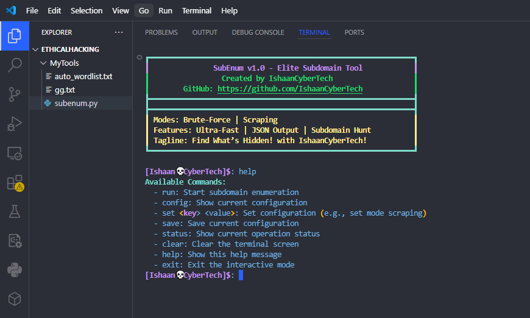

# 💀 SubEnum v1.0 - Elite Subdomain Hunter  
**Unleash the Hidden with IshaanCyberTech!**  

Yo, welcome to **SubEnum** – the ultimate subdomain sniping tool built for speed, stealth, and domination. Whether you're brute-forcing like a beast or scraping the web like a shadow, this bad boy finds what’s hiding in the dark corners of the internet. Ready to own the game? Let’s roll!  

---

## 🔥 What’s SubEnum All About?  
SubEnum is your go-to weapon for hunting subdomains – those sneaky little doors into websites. It’s got two killer modes:  
- **Brute-Force Mode**: Smashes through possibilities like a cyber tank.  
- **Scraping Mode**: Sneaks around the web, grabbing subdomains from secret spots.  

**Why it’s dope**:  
- Lightning fast – no waiting around.  
- Saves results in JSON – clean and pro.  
- Sexy visuals – watch it work in style.  

  
*Boom! Look at those subdomains popping up like targets in a shooting range!*  

---

## 🎯 Why You’ll Love It  
- **Find Hidden Gems**: Dig up subdomains others miss – perfect for security checks or just flexing your skills.  
- **Hack the Planet**: Test websites, spot weak points, and stay ahead of the game.  
- **Bragging Rights**: Show off your finds with slick output and share the glory.  
- **Free Power**: Open-source, baby – all this juice for zero bucks!  

---

## 🚀 How to Get Started  
Ready to fire this up? It’s as easy as 1-2-3.  

### Step 1: Grab It  
Clone this beast from GitHub:  
```bash
git clone https://github.com/IshaanCyberTech/SubEnum.git  
cd SubEnum  
