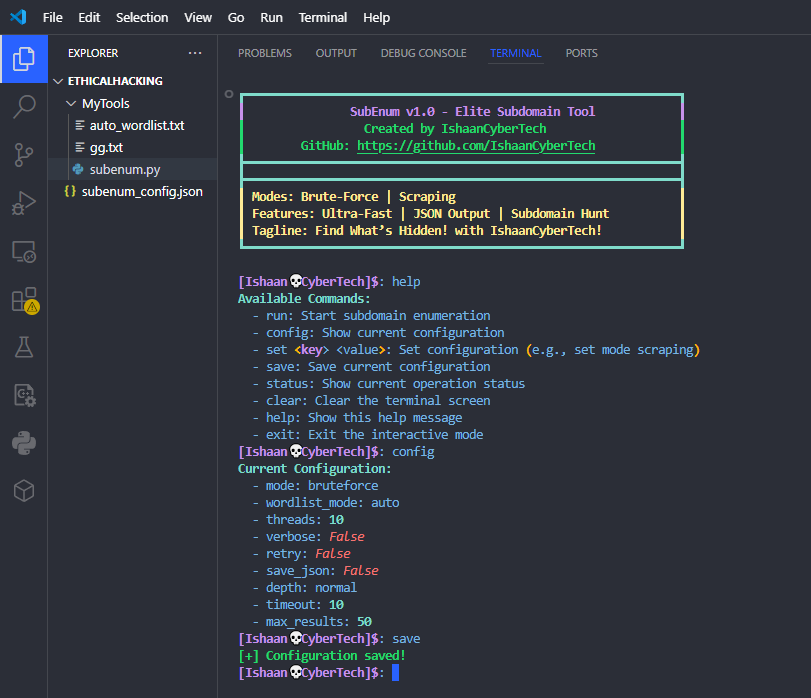
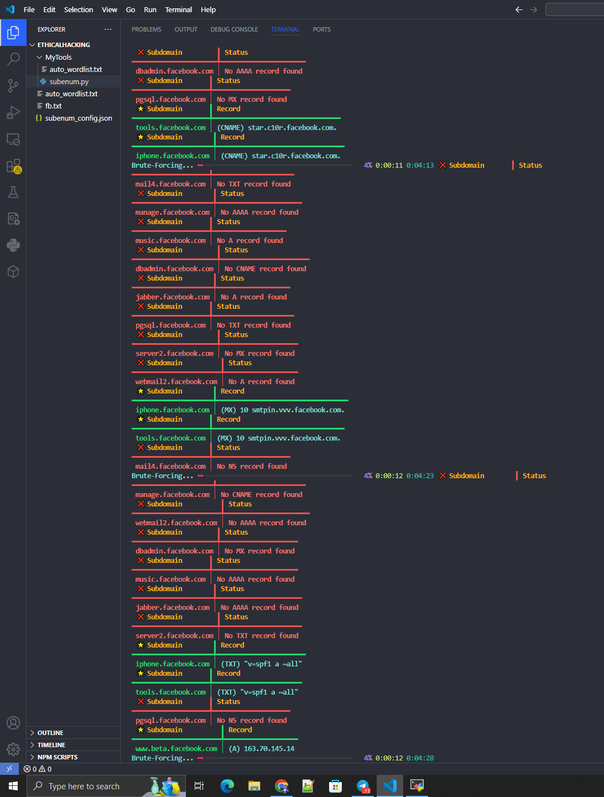
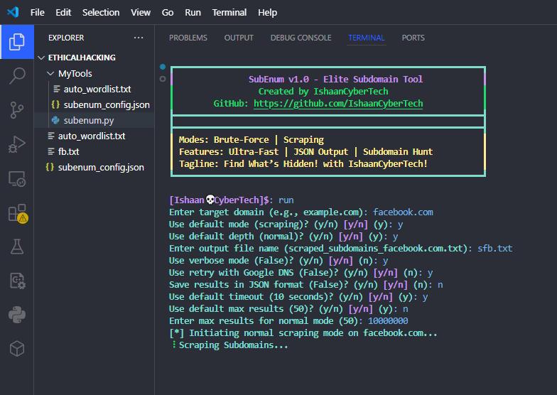
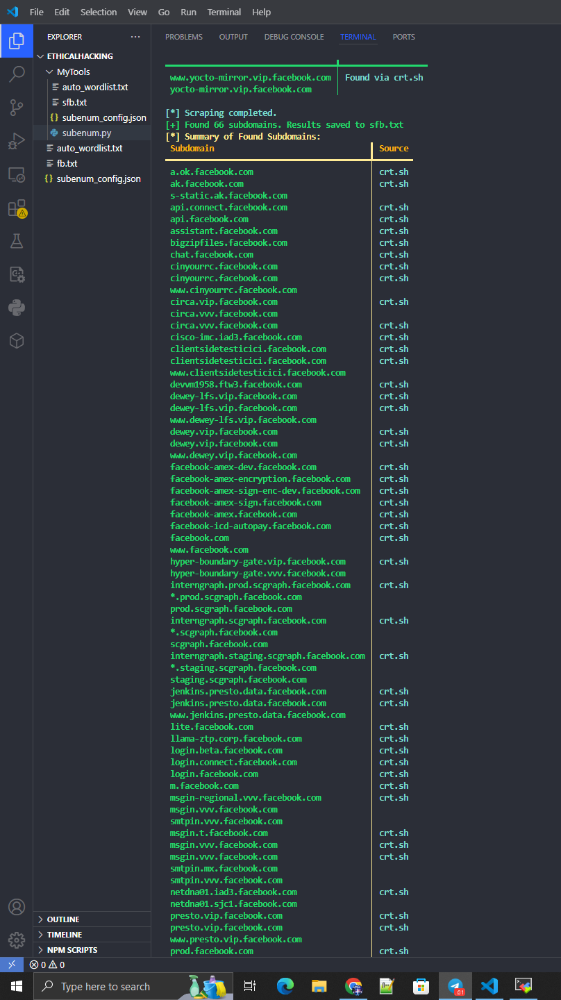

# 💀 SubEnum v1.0 - Elite Subdomain Hunter

**Unleash the Hidden with IshaanCyberTech!**

Welcome, cyber warriors. Meet **SubEnum** – your elite weapon for subdomain hunting. Whether you're brute-forcing your way through or scraping the web like a stealth ninja, this tool is built to **dominate**. Fast, powerful, and 100% open source.

---

## 🔥 What is SubEnum?

SubEnum is a powerful subdomain enumeration tool built for speed and precision. It supports two primary hunting methods:

- 🚀 **Brute-Force Mode**: Unleashes a dictionary attack to find hidden subdomains.
- 🕵️ **Scraping Mode**: Gathers subdomains stealthily from multiple web sources.

### 💡 Key Features

- ⚡ **Ultra-fast performance**
- 💾 **JSON output** to save your discoveries
- 🎨 **Interactive terminal interface** with real-time feedback
- 🛠️ **Customizable configs** to fit your flow

<div align="center">
  
  <br>
  <strong>SubEnum Lighting Up the Shadows – Ready to Roll?</strong>
</div>

---

## 🎯 Why You Need This

- ✅ **Discover Hidden Subdomains**: Gain access to domains others miss.
- 🛡️ **Enhance Security Testing**: Find potential weak points.
- 🔥 **Look Like a Pro**: Real-time interface, smart reporting.
- 💸 **Free & Open Source**: Hack the planet responsibly.

<div align="center">
  
  <br>
  <strong>Interactive Mode – Your Hacker Dashboard is Live!</strong>
</div>

---

## ⚙️ Installation

Getting started is super simple:

```bash
git clone https://github.com/IshaanCyberTech/SubEnum.git
cd SubEnum
python subenum.py
```

Make sure you have Python 3 installed. That’s it — you’re in.

---

## ⚡ Quick Start Guide

Once you're inside, here’s the command cheat sheet:

| Command             | Description                                  |
|---------------------|----------------------------------------------|
| `run`              | Start subdomain enumeration                   |
| `config`           | Show current configuration                    |
| `set <key> <val>`  | Update a config option (e.g., `set mode scraping`) |
| `save`             | Save your current configuration               |
| `status`           | Show current operation status                 |
| `clear`            | Clear the terminal screen                     |
| `help`             | Show help menu                                |
| `exit`             | Exit interactive mode                         |

### 🎯 Example Attack Flow

```bash
> run
> Target: example.com
> Mode: brute-force or scraping
> Watch the results roll in like a boss 💥
```

<div align="center">
  
  <br>
  <strong>Brute-Force Mode Dropping Subdomain Bombs – You’re Crushing It!</strong>
</div>

---

## 🔧 Customize It Like a Pro

Wanna tweak the tool to fit your speed and style? Easy.

| Setting               | Description                               |
|-----------------------|-------------------------------------------|
| `set threads 50`     | Max out speed with multi-threading        |
| `set verbose true`   | See detailed output for each subdomain    |
| `set save_json true` | Save results to a JSON file               |

<div align="center">
  
  <br>
  <strong>Scraping Mode Sniping Subdomains from the Wild – Pure Stealth!</strong>
</div>

<div align="center">
  
  <br>
  <strong>Mission Complete – Results Locked. You’re the Champ!</strong>
</div>

---

## 🌟 Why Choose SubEnum?

- 🧠 **Smart and Stealthy**: Blends speed with subtlety
- 🔍 **Accurate Enumeration**: Clean, structured output
- 🔧 **Open Source**: Tweak it. Fork it. Improve it.
- 🎯 **Battle-Tested**: Built by hackers, for hackers

---

## 🔗 Connect With the Creator

Stay updated, share feedback, and join the cyber fam!

<div align="center">
  <a href="https://www.youtube.com/@ishaancybertech" target="_blank">
    
  </a>
  <a href="https://instagram.com/ishaancybertech" target="_blank">
    
  </a>
  <a href="https://twitter.com/ishaancybertech" target="_blank">
    
  </a>
  <a href="mailto:ishaancybertech@gmail.com" target="_blank">
    
  </a>
  <a href="https://linkedin.com/in/ishaancybertech" target="_blank">
    
  </a>
</div>

---

> 💬 **Built with 💻 + ☕ by IshaanCyberTech – Let’s hack the hidden.**

```

---

